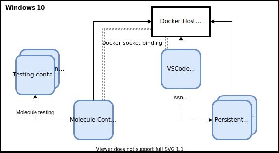

# ansible-environments
Reproductible environment for testing purposes



# Quick start with VSCode

```ps
git clone https://github.com/playerla/ansible-environments
code ansible-environments
```

[](vscode://vscode.git/clone?url=https://github.com/playerla/ansible-environments)

# Environment

## Docker proxy
```ps
docker run -it  docker docker images
```
> `error during connect: Get http://docker:2375/v1.40/images/json: dial tcp: lookup docker on 192.168.65.1:53: no such host`
Not docker in docker : it's socket connection to Docker Host through the volume option :
```ps
docker run -it -v /var/run/docker.sock:/var/run/docker.sock docker docker images
```
>docker      latest              81f5749c9058        2 months ago        211MB \
alpine      3.11.2              cc0abc535e36        8 months ago        5.59MB


## Molecule

[Test ansible roles in containers](https://molecule.readthedocs.io/en/latest/examples.html#docker)

# Biography

- https://jpetazzo.github.io/2015/09/03/do-not-use-docker-in-docker-for-ci/
- https://tomgregory.com/running-docker-in-docker-on-windows/